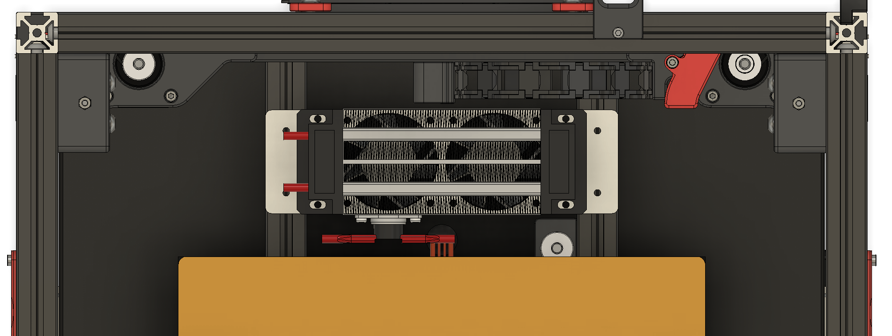
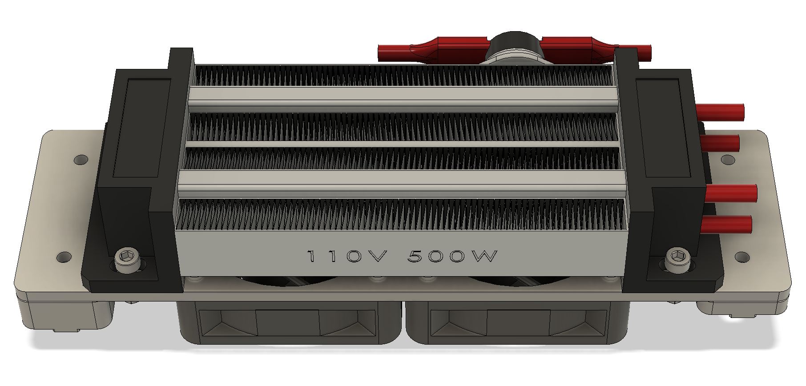
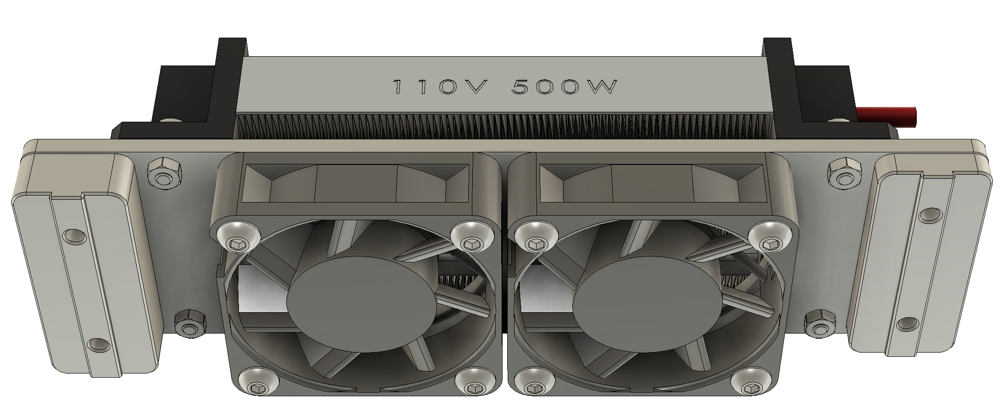

# PTC Heater Mounting Plate for Voron 2.4 Printers
Mounting plate for a 110V 500W PTC Heater module. Fits on Voron 2.4 bed rails.

Should fit in the back of the bed, on top of the 2020 Bed Rails.

Should fit in a 250 size and above.

## NOTE THIS IS A SPICY MEATBALL

:fire:

**Do NOT ask about this in the Voron Design Discord.**

Instead, join us in [Armchair Engineering](https://discord.gg/armchairengineeringsux) in [#spicy-meatball](https://discord.com/channels/1029426383614648421/1151296680168275978)

---

## Simple PTC Heater bracket.

* 0.125" / 3.175mm 303 Stainless Steel laser cut at SendCutSend.com: $15

* SCS Minimum order is $29, so buy two and share with a friend.
* You can get two plates laser cut, deburred and powder coated for $30.

* Holes for the fans are sized for M4 tapping, you'll need to DIY.
* Holes for the PTC Heater are sized for M3 3.2mm clearance, no tapping.

* Holes can also be tapped by SCS, but the price goes up a lot. 😬
* Holes on the ends are for 2020 mounting, M3 3.2mm clearance.
* Fits right on top of the bed rails for a 2.4 Voron.
* 5015 Fans so there's 5mm clearance, if you need more room both 5mm and 10mm printed spacers are options.

---

### Parts List
* PTC Heater, 110V 500W from Amazon: https://a.co/d/3dBJtb6
* 2 x 5015 axial (not blower) fan: 50x50x15mm
  * Suggested: [Delta AFB0524HHB](https://www.digikey.com/en/products/detail/delta-electronics/AFB0524HHB/2560406), $15 ea
  * Optional: Any from this list from Digikey: [LIST](https://www.digikey.com/en/products/filter/dc-brushless-fans-bldc/217?s=N4IgjCBcpgLFoDGUBmBDANgZwKYBoQB7KAbXAFZyAmADggF0CAHAFyhAGUWAnASwDsA5iAC%2BBWADYEIZJHTZ8RUiFgAGCQE4A7A2ZtInHgOFjwGgMzTZ83AWKQy2jTRohGIVuy58hoguRoNK1RMWyUHcCoo8yl3TwNvYz8QLQ1VYLlQxXsyWDAJclV4OP1DHxMCMGcg6BkQhTtldPoRUyplQoBbToACdH43ESA)
  * Check your favorite ~~dealer~~ retailer to see if they have 5015 Axial (not blower) fans.

* M4 x 0.7 Thread Tap
  * Recommended: [uxcell M4 x 0.7 Spiral Flute Tap](https://www.amazon.com/uxcell-Machine-Threading-Nitriding-Tolerance/dp/B09765XYZD)
* 8 x M4 BHCS or SHCS, 20mm for the fans.
* 4 x M3 BHCS or SHCS, 10mm for the PTC Heater.
* 4 x M3 nuts for the PTC Heater.
* 4 x M3 screws for mounting to the bed rails:
  * 8mm for the bare plate.
  * 14mm for the 5mm spacer.
  * 20mm for the 10mm spacer, plus maybe 1-2 washers each.
* Recommended: Omron G3NA or G3NB SSR
* Recommended: Metal DIN Rail SSR Mount

---

### Pictures

---

## DXF File for SCS:
[PTC Heater Mount v8.DXF](/DXF/PTC%20Heater%20Mount%20v8.dxf)

Also illustration drawing: [PTC Heater Mount Drawing.PDF](/dxf/PTC%20Heater%20Mount%20Drawing.pdf) (Not for SCS)

---

Please don't burn your house down.