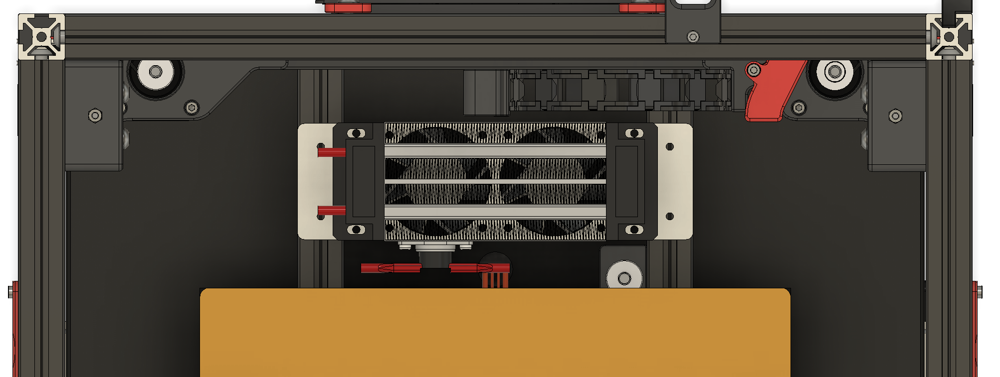

# PTC Heater Mounting Plate for Voron 2.4 Printers
Mounting plate for a 110V 500W PTC Heater module. Fits on Voron 2.4 bed rails.

Should fit in the back of the bed, on top of the 2020 Bed Rails.

Should fit in a 250 size and above.

## NOTE THIS IS A SPICY MEATBALL

:fire:

**Do NOT ask about this in the Voron Design Discord.**

Instead, join us in [Armchair Heavy Industries](https://discord.gg/armchairengineeringsux) in [#spicy-meatball](https://discord.com/channels/1029426383614648421/1151296680168275978)

---

## Simple PTC Heater bracket.

* Plate laser cut at SendCutSend.com
* Material: 0.125" / 3.175mm 5052 Aluminum or 0.119" / 3.0mm A36/1008 Mild Steel 
* I chose Stainless Steel on my first version, and I did actually tap it with a M4 Spiral Tap with Tap Magic.

* SCS Minimum order is $29, so buy two and share with a friend.
* You can get two plates laser cut, deburred and powder coated for $30.

* Holes for the fans are sized for M4 tapping, you'll need to DIY.
* Alternatively, drill out the holes for the fans and use 4mm Self Tapping Fan Screws.
* Holes for the PTC Heater are sized for M3 3.2mm clearance, no tapping.

* Holes can also be tapped by SCS, but the price goes up a lot. 😬
* Holes on the ends are for 2020 mounting, M3 3.2mm clearance.
* Fits right on top of the bed rails for a 2.4 Voron.
* 5015 Fans so there's 5mm clearance, if you use the alternative 5032 fans you will have to add spacers or adjust otherwise.

---

### Parts List

* Spicy Meatball Plate from either:
  * [SendCutSend](https://sendcutsend.com), using the DXF drawing. I recommend steel if you're going to tap the fan holes, or have SCS tap them for you.
  * EUrobros can use https://xometry.eu/en/ for good pricing and very cheap shipping - thanks to Silvertungas for the recommendation.

* PTC Heater, 110V 500W from:
   * Amazon https://a.co/d/0az0stFU
   * Amazon https://a.co/d/3dBJtb6
   * Any 500W *Insulated* PTC heater with dimensions of 140x50x~26mm should work. 
   * 300W heaters will be too short, and won't work without some modifications.
    

* 2 x 5015 or 5032 axial (not blower) fan: 50x50x15mm or 50x50x32mm
  * Suggested: [Delta AFB0524HHB 24v](https://www.digikey.com/en/products/detail/delta-electronics/AFB0524HHB/2560406), $15 ea
  * Optional: Any from this list from Digikey: [LIST](https://www.digikey.com/en/products/filter/dc-brushless-fans-bldc/217?s=N4IgjCBcpgLFoDGUBmBDANgZwKYBoQB7KAbXAFZyAmADggF0CAHAFyhAGUWAnASwDsA5iAC%2BBWADYEIZJHTZ8RUiFgAGCQE4A7A2ZtInHgOFjwGgMzTZ83AWKQy2jTRohGIVuy58hoguRoNK1RMWyUHcCoo8yl3TwNvYz8QLQ1VYLlQxXsyWDAJclV4OP1DHxMCMGcg6BkQhTtldPoRUyplQoBbToACdH43ESA)
  
You want the *maximum* airflow that you can get, if possible.
5015's were chosen initially because they are only 15mm thick and fit under a 20mm extrusion with some gap.

If you have more room, use stronger fans with more airflow.

  * MAX AIRFLOW ALTERNATIVE: Delta 5032 Fans (50x50x32mm) 12V: 
    * [Delta PFB0512EHF 12V via Luke's Laboratory](https://www.lukeslabonline.com/products/delta-5032-fan-pfb0512ehf)
    * [Delta PFB0512EHF 12V via Digikey](https://www.digikey.com/en/products/detail/delta-electronics/PFB0512EHF/9478084)
    * You may need something to space the plate off by 17-20mm with these thicker fans. 
  
      e.g. M5 Hollow aluminum spacers 20mm long.

      If you use M5 Hollow Aluminum Spacers, you can also drill out the four plate mounting holes and use M5 screws to mount the plate, but it's not strictly necessary.
    * Taller spacers may cause the heater to encroach above the bed area.

      Don't crash your hotend.

    * I do not recommend the printed spacers any more, they have been removed.
  

* M4 x 0.7 Thread Tap
  * Only if you get steel or stainless steel from SendCutSend and you intend to tap it.
 Aluminum is too thin/soft to tap well.
  * Recommended: [uxcell M4 x 0.7 Spiral Flute Tap](https://www.amazon.com/uxcell-Machine-Threading-Nitriding-Tolerance/dp/B09765XYZD)
  * Also get some tapping fluid like Tap Magic, especially for steel or stainless.
* 8 x M4 BHCS or SHCS, 20mm for the fans. Slightly longer for the Provok3d version with M4 nuts.
* 4 x M3 BHCS or SHCS, 10mm for the PTC Heater.
* 4 x M3 nuts for the PTC Heater.
* 4 x M3 screws for mounting to the bed rails:
  * 8mm for the bare plate.
  * ~ 25mm long if you're using a spacer.
  
* Recommended: Omron G3NA or G3NB SSR
* Recommended: Metal DIN Rail SSR Mount

---

### Pictures

---

## DXF File for SCS:
[PTC Heater Mount v8.DXF](/DXF/PTC%20Heater%20Mount%20v8.dxf)

Also illustration drawing: [PTC Heater Mount Drawing.PDF](/dxf/PTC%20Heater%20Mount%20Drawing.pdf) (Not for SCS)

---

Please don't burn your house down.
